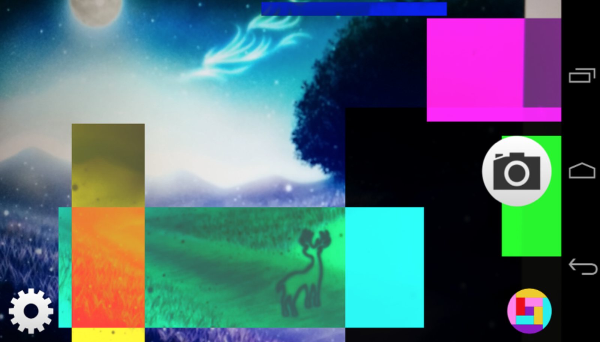

PacketCAM = Packet + CAMERA
=========
**ネットワークを流れるパケットとスマホのカメラを組み合わせたAndroidアプリケーション**

スライドやJavaDoc等は，[こちらのページ](http://www.firefly.kutc.kansai-u.ac.jp/~mizho/packetcam/index.html)にあります．

## アプリケーション説明
PacketCAMでは，ネットワークパケットの情報に基づき，リアルタイムにカメラにエフェクトをかけます．

現実世界に対してネットワークパケットを使ってエフェクトをかけることで，サイバー空間ならぬパケット空間を演出し，
普段とは違う見せ方をしたいと考え制作いたしました．

### パケット情報
使用するパケット情報について，なるべくエフェクトと関係のある使い方をしたいと考えました．  
なので，以下のような情報をそれらしい用途で使っています．
* IPアドレス： エフェクトの起点となるXY座標
* TTL： エフェクトの描画時間
* ポート番号： エフェクトの色
* Windowサイズ： エフェクトの描画サイズ

ここでは特徴的なものを挙げましたが，これら以外にも数種類の情報を使っています．

## 技術詳細
本アプリケーションは，大まかに，パケットに関する処理とエフェクトの描画に関する処理に大別できます．  
そして，それらが連動してアプリケーションが動いています．

### パケットに関する処理
まず，パケットのダンプファイルからパケットを読み込みます．  
パケットの解析には，[jNeStream](http://jnetstream.com/)というPure Javaでコーディングされたライブラリを利用しています．  
ダンプファイルからパケットを抽出し解析し終えたら，250ms間隔でパケットを貯めるキューに装填します．

### エフェクトの描画に関する処理
まずOpenGL ESを用いて，OpenGLのテクスチャにカメラプレビューを描画します．  
その後，キューにパケットが装填されていた場合にキューからパケットを取り出し，
そのパケット情報から生成したエフェクトとテクスチャをブレンディングします．

## 動作環境
Android OS 4.0以上（Nexus5等で動作確認）

## 依存ライブラリ
[jnestream 3.0a](http://jnetstream.com/)
  (GPLv2, LGPLv2.1)

製作者
===
Team Kobasemi (Kousaka Funada Akasaka Hibino)

ライセンス
===
MIT License
